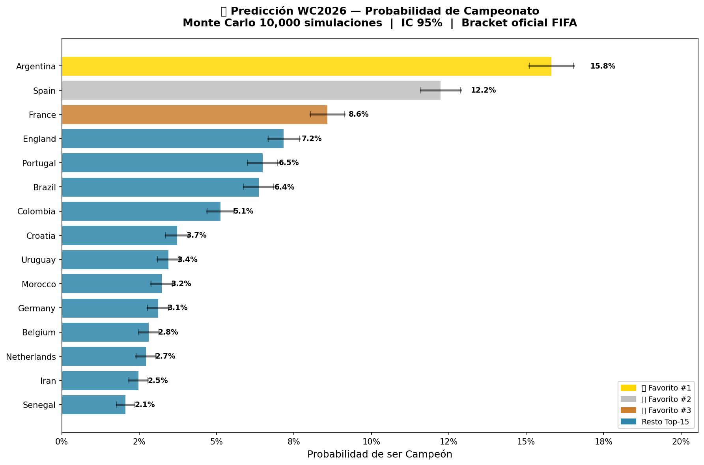
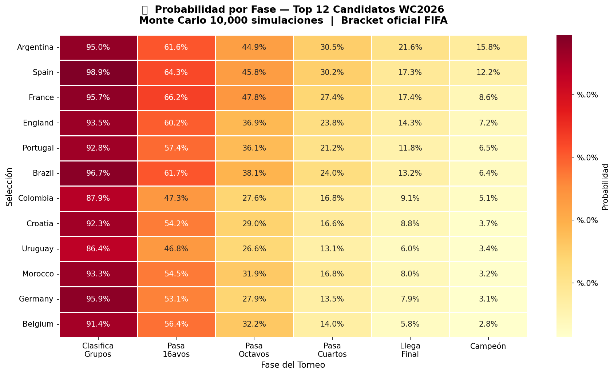
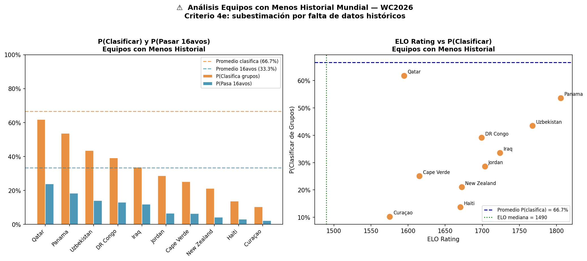

# 🏆 El Oráculo del Balón — Predicción Mundial 2026

[](https://www.python.org/downloads/)
[](https://xgboost.readthedocs.io/)
[]()

Pipeline de Machine Learning para predecir la probabilidad de que cada una de las **48 selecciones** se corone campeona del **Mundial FIFA 2026**, mediante clasificación de resultados de partido (gana/empata/pierde) y simulación de Monte Carlo del torneo completo respetando el **bracket oficial FIFA** con las 495 combinaciones del Anexo C del reglamento.

---

## 📋 Tabla de contenidos

- [🏆 El Oráculo del Balón — Predicción Mundial 2026](#-el-oráculo-del-balón--predicción-mundial-2026)
  - [📋 Tabla de contenidos](#-tabla-de-contenidos)
  - [💡 Motivación](#-motivación)
  - [🏆 Resultados](#-resultados)
  - [🏗️ Arquitectura del pipeline](#️-arquitectura-del-pipeline)
  - [⚙️ Instalación y ejecución](#️-instalación-y-ejecución)
    - [Requisitos](#requisitos)
    - [Pasos](#pasos)
    - [Ejecutar notebooks en orden](#ejecutar-notebooks-en-orden)
    - [Reproducibilidad sin reentrenar](#reproducibilidad-sin-reentrenar)
  - [📁 Estructura del proyecto](#-estructura-del-proyecto)
  - [📊 Fuentes de datos](#-fuentes-de-datos)
  - [🔧 Features del modelo](#-features-del-modelo)
    - [ELO Rating](#elo-rating)
    - [Time Decay](#time-decay)
  - [📈 Modelo y métricas](#-modelo-y-métricas)
    - [Validación histórica WC2022](#validación-histórica-wc2022)
    - [Feature importance XGBoost](#feature-importance-xgboost)
  - [🎲 Simulación Monte Carlo](#-simulación-monte-carlo)
    - [Formato WC2026 implementado](#formato-wc2026-implementado)
    - [Criterios de clasificación de mejores terceros](#criterios-de-clasificación-de-mejores-terceros)
    - [Bracket oficial dieciseisavos](#bracket-oficial-dieciseisavos)
    - [Reproducibilidad](#reproducibilidad)
  - [⚠️ Limitaciones](#️-limitaciones)
  - [📚 Referencias](#-referencias)

---

## 💡 Motivación

El Mundial 2026 introduce un formato inédito: **48 equipos en 12 grupos de 4**, con dieciseisavos de final como nueva ronda eliminatoria y 8 mejores terceros clasificando según 495 combinaciones predefinidas por la FIFA (Anexo C del reglamento oficial).

Entrenar un modelo que prediga directamente al "campeón" no funciona — habría 1 positivo y 47 negativos por torneo, cayendo en un problema severo de desbalance de clases. En cambio, este proyecto:

1. Entrena un **clasificador a nivel de partido** (gana/empata/pierde)
2. Usa las probabilidades del modelo para **simular el torneo completo 10,000 veces**
3. Cuenta las frecuencias para obtener **probabilidades de campeonato con IC 95%**

---

## 🏆 Resultados

Predicción final basada en 10,000 simulaciones Monte Carlo con bracket oficial FIFA:

| Rank | Selección | P(Campeón) | IC 95%          |
| ---- | --------- | ---------- | --------------- |
| 🥇 1  | Argentina | 15.8%      | [15.1% – 16.5%] |
| 🥈 2  | Spain     | 12.2%      | [11.6% – 12.9%] |
| 🥉 3  | France    | 8.6%       | [8.0% – 9.1%]   |
| 4    | England   | 7.2%       | [6.7% – 7.7%]   |
| 5    | Portugal  | 6.5%       | [6.0% – 7.0%]   |

Probabilidad de campeonato por equipo (Top 15):



Probabilidad por fase — Top 12 candidatos:



Análisis de equipos con menos historial mundial:



> Semilla aleatoria fijada en `np.random.seed(42)` para garantizar reproducibilidad.
> Los resultados pueden variar levemente con semillas distintas pero el Top-5 se mantiene estable.

---

## 🏗️ Arquitectura del pipeline

```
Fuentes de datos (Kaggle, GitHub, Transfermarkt, World Bank, Football-Data.org)
        ↓
src/descarga_recursos.py — Descarga y limpieza de todas las fuentes
        ↓
notebooks/02_eda_time_decay.ipynb — EDA + Time Decay exponencial
        ↓
notebooks/03_features_model.ipynb — Feature Engineering + XGBoost + Validación WC2022
        ↓
notebooks/04_montecarlo_wc2026.ipynb — Simulación Monte Carlo 10,000 iteraciones
        ↓
reports/ — Top-5 con IC 95% + 3 visualizaciones
```

---

## ⚙️ Instalación y ejecución

### Requisitos
- Python 3.12+
- Cuenta en [Kaggle](https://www.kaggle.com) con API key
- Token gratuito de [Football-Data.org](https://www.football-data.org/client/register)

### Pasos

```bash
# 1. Clonar el repositorio
git clone https://github.com/<tu-usuario>/oraculo-mundial2026.git
cd oraculo-mundial2026

# 2. Crear entorno virtual
python -m venv .venv
source .venv/bin/activate        # Linux/Mac
# .venv\Scripts\activate         # Windows

# 3. Instalar dependencias
pip install -r requirements.txt

# 4. Configurar credenciales
# Crear archivo .env en la raíz del proyecto con este contenido:
#
#   KAGGLE_USERNAME=tu_usuario
#   KAGGLE_KEY=tu_api_key
#   FOOTBALL_DATA_API_TOKEN=tu_token
#
# Las credenciales de Kaggle se obtienen en:
#   https://www.kaggle.com/settings → API → Create New Token
# El token de Football-Data.org se obtiene en:
#   https://www.football-data.org/client/register

# 5. Descargar y limpiar todos los datos
python src/descarga_recursos.py
```

### Ejecutar notebooks en orden

Los notebooks deben ejecutarse **en orden secuencial** ya que cada uno genera
archivos que el siguiente consume.

```bash
jupyter lab
```

| Orden | Archivo                                | Descripción                               |
| ----- | -------------------------------------- | ----------------------------------------- |
| 1     | `src/descarga_recursos.py`             | Descarga y limpieza de todas las fuentes  |
| 2     | `notebooks/02_eda_time_decay.ipynb`    | EDA completo + time decay exponencial     |
| 3     | `notebooks/03_features_model.ipynb`    | 15 features + XGBoost + validación WC2022 |
| 4     | `notebooks/04_montecarlo_wc2026.ipynb` | Monte Carlo + bracket oficial + Top-5     |

> ⚠️ `descarga_recursos.py` puede tardar varios minutos dependiendo de la velocidad de conexión.
> NB03 tarda ~30 segundos calculando ELO desde 1872 (~49,000 partidos).
> NB04 tarda ~5 minutos corriendo 10,000 simulaciones completas del torneo.

### Reproducibilidad sin reentrenar

Los modelos entrenados (`.pkl`) están incluidos en el repositorio.
Si solo quieres ver los resultados del Monte Carlo sin reentrenar, puedes
ejecutar directamente el NB04 después de instalar dependencias.

---

## 📁 Estructura del proyecto

```
oraculo-mundial2026/
│
├── notebooks/
│   ├── 02_eda_time_decay.ipynb         # EDA y decay temporal
│   ├── 03_features_model.ipynb         # Features, modelo y validación
│   └── 04_montecarlo_wc2026.ipynb      # Simulación Monte Carlo
│
├── src/
│   ├── descarga_recursos.py            # Descarga y limpieza de datos
│   └── tournament_structure.py         # Estructura oficial WC2026
│                                       # Grupos A-L, fixtures 72 partidos,
│                                       # bracket oficial y función
│                                       # asignar_terceros_a_cruces()
│
├── data/
│   ├── raw/                            # Datos descargados (excluido de git)
│   └── processed/                      # Datos limpios y artefactos
│       ├── results_clean.csv           # Partidos 1993-2026 con time_weight
│       ├── results_historico_1872.csv  # Histórico desde 1872 para ELO
│       ├── ranking_clean.csv           # Ranking FIFA jun-2024
│       ├── transfermarkt_clean.csv     # Valores de plantilla WC2026
│       ├── worldbank_clean.csv         # Indicadores socioeconómicos
│       ├── wc2026_grupos.csv           # 72 partidos fase de grupos
│       ├── wc2026_players_top_league.csv  # Jugadores en ligas top 5
│       ├── wc2022_eval.csv             # Partidos WC2022 reales
│       ├── wc2022_predictions.csv      # Predicciones vs realidad WC2022
│       ├── elo_ratings.csv             # ELO final todos los equipos
│       ├── elo_history.csv             # Snapshot ELO histórico
│       ├── features_dataset.csv        # Dataset completo 15 features
│       ├── xgb_model.pkl               # Modelo XGBoost entrenado ✅
│       ├── lr_model.pkl                # Regresión Logística baseline ✅
│       ├── label_encoder.pkl           # LabelEncoder A=0, D=1, H=2 ✅
│       ├── scaler.pkl                  # StandardScaler entrenado ✅
│       ├── metricas_finales.json       # Métricas consolidadas
│       └── matriz_mundial_495.json     # 495 combinaciones Anexo C FIFA
│
├── reports/
│   ├── wc2026_champion_probs.csv       # Probabilidades todos los equipos
│   ├── wc2026_top5_results.json        # Top-5 con IC 95%
│   ├── fig1_champion_probabilities.png # Barras Top-15 con IC
│   ├── fig2_heatmap_fases.png          # Heatmap probabilidad por fase
│   └── fig3_equipos_debiles.png        # Análisis equipos debutantes
│
├── docs/
│   └── fuentes_de_datos.md             # Documentación detallada de fuentes
│
├── .env.example                        # Plantilla de variables de entorno
├── .gitignore                          # Excluye datos crudos, .npy y .env
├── requirements.txt                    # Dependencias del proyecto
└── README.md                           # Este archivo
```

---

## 📊 Fuentes de datos

La documentación detallada de cada fuente (URLs, método de obtención,
parámetros) está en `docs/fuentes_de_datos.md`.

| Fuente                                    | Descripción                       | Uso en el modelo              |
| ----------------------------------------- | --------------------------------- | ----------------------------- |
| martj42/international_results (GitHub)    | +49,000 partidos 1872-2026        | ELO histórico                 |
| FIFA World Ranking 1993-2024 (Kaggle)     | Ranking FIFA histórico            | Feature ranking y puntos FIFA |
| FIFA World Cup Matches 1974-2022 (Kaggle) | Partidos mundiales con xG         | Validación WC2022             |
| Football-Data.org API                     | Estadísticas ligas top 5 europeas | Jugadores en ligas top        |
| Transfermarkt (scraping)                  | Valor de mercado de plantillas    | Feature squad value           |
| World Bank Open Data API                  | PIB per cápita, población         | Features socioeconómicas      |
| Convocados WC2026 (scraping)              | Listas oficiales 48 selecciones   | Cruce con stats de ligas      |
| bracketmundial2026.com                    | Bracket oficial FIFA dic-2025     | Estructura eliminatoria       |

---

## 🔧 Features del modelo

El modelo predice resultados de partido (H/D/A) usando **15 features**
construidas a nivel de partido:

| Feature                                         | Descripción                       | Fuente                 |
| ----------------------------------------------- | --------------------------------- | ---------------------- |
| `elo_home` / `elo_away`                         | ELO rating calculado desde 1872   | Calculado internamente |
| `elo_diff`                                      | Diferencia de ELO entre equipos   | Calculado internamente |
| `fifa_rank_home` / `fifa_rank_away`             | Ranking FIFA (snapshot jun-2024)  | Kaggle                 |
| `fifa_points_diff`                              | Diferencia de puntos FIFA         | Kaggle                 |
| `squad_value_home` / `squad_value_away`         | Valor de plantilla en €           | Transfermarkt          |
| `squad_value_diff`                              | Diferencia de valor de plantilla  | Transfermarkt          |
| `players_top_lge_home` / `players_top_lge_away` | Jugadores en ligas top 5          | Football-Data.org      |
| `gdp_per_capita_home` / `gdp_per_capita_away`   | PIB per cápita                    | World Bank             |
| `is_neutral`                                    | 1 si la cancha es neutral         | Calculado              |
| `tournament_weight`                             | Peso del torneo (1.0 = World Cup) | Calculado              |

### ELO Rating

```python
ELO_INICIAL     = 1500   # para todos los equipos sin historial
HOME_ADVANTAGE  = 100    # puntos extra si no es cancha neutral

# K-factors por tipo de torneo
K_FIFA_WORLD_CUP  = 60
K_CONFEDERACIONES = 50
K_CLASIFICATORIAS = 40
K_AMISTOSOS       = 20
```

Top ELO actual: Spain=2096, Argentina=2046, France=2022, Portugal=1957, Brazil=1952

### Time Decay

```python
# Peso exponencial por antigüedad del partido
w = 0.5 ^ (días_atrás / 1095)

FECHA_CORTE = 2026-06-10
HALF_LIFE   = 3 años (1095 días)
```

---

## 📈 Modelo y métricas

Dos modelos entrenados con split temporal (train hasta jun-2025):

| Modelo              | Accuracy  | Log-Loss  | Brier Score |
| ------------------- | --------- | --------- | ----------- |
| **XGBoost** ⭐       | **57.5%** | **0.871** | **0.172**   |
| Regresión Logística | 57.0%     | 0.874     | 0.172       |

Hiperparámetros XGBoost:
```python
n_estimators=300, max_depth=4, learning_rate=0.05,
subsample=0.8, colsample_bytree=0.8
```

### Validación histórica WC2022

| Métrica     | Valor                  |
| ----------- | ---------------------- |
| Accuracy    | 51.6% (33/64 partidos) |
| Log-Loss    | 1.098                  |
| Brier Score | 0.213                  |

El modelo alcanzó 51.6% de accuracy en WC2022, superando el baseline
aleatorio (33.3%) y comparable al nivel humano experto (~50%). El Log-Loss
de 1.098 refleja la alta incertidumbre inherente al fútbol, especialmente
en fase eliminatoria donde una sorpresa como Argentina vs Arabia Saudita
es imposible de predecir con datos históricos.

### Feature importance XGBoost

| Rank | Feature            | Importancia |
| ---- | ------------------ | ----------- |
| 1    | `fifa_points_diff` | 21.67%      |
| 2    | `elo_diff`         | 14.75%      |
| 3    | `is_neutral`       | 6.88%       |
| 4    | `fifa_rank_home`   | 6.09%       |
| 5    | `fifa_rank_away`   | 5.52%       |

---

## 🎲 Simulación Monte Carlo

### Formato WC2026 implementado

```
48 equipos → 12 grupos de 4
        ↓
Fase de grupos: 72 partidos
        ↓
32 clasificados:
  2 primeros de cada grupo (24 directos)
  8 mejores terceros de 12 grupos
        ↓
Bracket oficial FIFA — Anexo C (495 combinaciones)
        ↓
Dieciseisavos (32→16) → Octavos (16→8) → Cuartos (8→4)
→ Semifinales (4→2) → Tercer lugar → Final
Total: 104 partidos
```

### Criterios de clasificación de mejores terceros

Orden oficial FIFA:
1. Puntos obtenidos en fase de grupos
2. Diferencia de goles
3. Goles marcados
4. Ranking FIFA
5. Sorteo

### Bracket oficial dieciseisavos

Los **4 líderes sin tercero** (cruces fijos):

| Partido | Cruce    |
| ------- | -------- |
| P74     | 1C vs 2F |
| P75     | 1F vs 2C |
| P84     | 1H vs 2J |
| P86     | 1J vs 2H |

Los **8 líderes con tercero** asignados según `matriz_mundial_495.json`:

| Partido | Líder    |
| ------- | -------- |
| P76     | 1E vs 3° |
| P77     | 1I vs 3° |
| P79     | 1A vs 3° |
| P80     | 1L vs 3° |
| P81     | 1D vs 3° |
| P82     | 1G vs 3° |
| P85     | 1B vs 3° |
| P87     | 1K vs 3° |

```python
# Asignación exacta del tercero según Anexo C FIFA
clave      = "".join(sorted(grupos_terceros))  # ej: "ABCDEFGI"
asignacion = matriz_495[clave]                 # ["3C","3F","3I",...]
```

### Reproducibilidad

```python
np.random.seed(42)
N_SIMULATIONS = 10_000
```

---

## ⚠️ Limitaciones

1. **Lesiones e imprevistos**: el modelo no puede predecir lesiones de
   último momento ni cambios de forma recientes al torneo.

2. **Equipos con menos historial**: Curaçao, Haití y New Zealand tienen
   historial limitado. El modelo los penaliza principalmente por ELO bajo,
   aunque factores como la composición del grupo tienen mayor peso —
   Qatar (ELO=1610) clasifica con 62% por estar en el Grupo B, mientras
   Panamá (ELO=1810) solo alcanza 53% por enfrentar a Inglaterra y Croacia
   en el Grupo L.

3. **Penales**: los desempates en eliminatorias se simulan con probabilidad
   50/50, sin modelar la habilidad específica de cada selección.

4. **Neutralidad del bracket**: en fase eliminatoria se asume cancha siempre
   neutral. Los anfitriones (USA, Canadá, México) tienen ventaja de localía
   solo en la fase de grupos.

5. **Datos estáticos**: el ranking FIFA usado es snapshot de junio 2024.

---

## 📚 Referencias

- FIFA World Cup 2026 Competition Regulations — Annex C (495 combinations)
- [bracketmundial2026.com](https://bracketmundial2026.com) — Bracket oficial WC2026
- Elo, A. E. (1978). *The Rating of Chessplayers, Past and Present*. Batsford.
- Chen, T., & Guestrin, C. (2016). XGBoost: A Scalable Tree Boosting System. *KDD '16*.
- [martj42/international_results](https://github.com/martj42/international_results)
- [World Bank Open Data](https://data.worldbank.org)

---

*Proyecto académico — Curso de Machine Learning 2026*